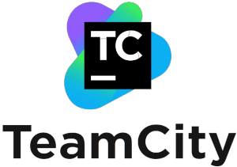
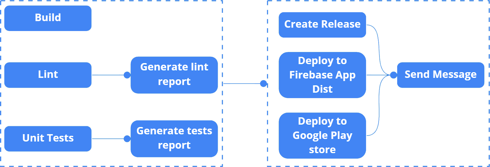

# Continuous Integration and Continuous Delivery for Android Projects

## [Work In Progress- feature branch]

<p align="center">


This is a simple android application that will be used to demo android CI/CD process using [GitHub Action](https://github.com/features/actions) as part of [ACL session](https://docs.google.com/presentation/d/1KBKK27I8Ji3m7Xs76G-uuzRhD8JY1NfVySQSWd0KT3A/edit?usp=sharing).

`Continuous integration` is a practice of integrating source code into a shared repository frequently, then each commit is verified by an automated system to check for errors or get reports on code quality.

Examples of continuous integration processes for android projects include:

- Performing build.
- Linting - Analyzing source code to check for language syntax violation.
- Executing tests  ie. unit tests and instrumentation tests.
- Generating reports. Eg tests reports, lint reports etc.

`Continuous delivery` is a practice of getting changes(ie. new features, bug fixes, configuration changes) into production or into the users’/testers’ hands safely and quickly or frequently.

Examples of continuous delivery processes for android projects include:

- Creating a [GitHub release](https://docs.github.com/en/repositories/releasing-projects-on-github/about-releases).
- Deploying to [Firebase App Distribution](https://firebase.google.com/docs/app-distribution).
- Deploying to Google Play Store.
- Updating automated documentation. Eg. when using automated documentation tools like [Dokka](https://github.com/Kotlin/dokka).

## CI/CD Platforms/Tools

<p align="center">
   

<p align="center">
   

1. GitHub Actions.
2. [Gitlab CI/CD](https://docs.gitlab.com/ee/ci/)
3. [Jenkins](https://www.jenkins.io/)
4. [Circle CI](https://circleci.com/)
5. [Travis CI](https://travis-ci.org/)
6. [Team City](https://www.jetbrains.com/teamcity/)

## Getting Started

Simplified overview of the project's CI/CD pipeline:



## Intro

In order to create a workflow which will contain the jobs required for the CI/CD processes, create a new directory in the project's root destination from android studio or your file explorer.

> From Android Studio create `.github/workflows` directory in the project's root destination. [Like so](https://github.com/VictorKabata/Android-CI-CD/tree/main/.github/workflows).

> From file explorer create `.github->workflows` in the project's root destination.

Create a new [YAML](https://yaml.org/) file inside the workflows directory. Eg. `build.yml`

Add the code from the snippets below in the YAML file that you've created.

Start by defining the name of the workflow and what events will trigger the execution of the workflow on the specified branch(es).

```YAML
name: Build # name of the workflow

on:
  push: # specifies events to trigger the workflow
    branches: [ feature ] # branches that trigger the workflow

...continued # do not include in workflow file
```

## Build Job

The first job which is the build job is defined below the `jobs:` tag. Start by declaring the name of the job which is optional. Then declaring the OS version of the runner that will execute the job. Examples of OS versions include; `linux-latest`, `windows-latest` and `mac-os-latest`. The next part is declaring the steps to be executed in this job. The first step is an action execution to checkout the code from the repository to the runner then set up JDK version 11 to the the runner and finally execute `./gradlew build` gradle command.

```YAML
...continuation # do not include in workflow file

jobs: # groups the jobs to be executed in this workflow

  build: # defines a job called build
    name: 🔨 Build # [optional] name of the job
    runs-on: ubuntu-latest # the job will be executed on ubuntu runner. Other include: Microsoft Windows & MacOS runners
    steps: # groups together all the steps that run in build job

      # Checks out code from the VCS to the runner
      - name: Checkout code # [optional] specifies the name of the step
        uses: actions/checkout@v2 # specifies which action and version to execute ie. checkout@v2

      # Setup JDK Version 11 in the runner
      - name: Set up JDK 11
        uses: actions/setup-java@v1
        with:
          java-version: '11'

      # Allow permissions to make gradle executable - This can removed by adding the gradlew file permission
      # directly into the repository using `git update-index --chmod=+x gradlew`
      # - name: Make gradle executable
      #  run: chmod +x ./gradlew

      # Execute gradle build command with stacktrace flag
      - name: Build with gradle
        run: ./gradlew build --stacktrace # Execute gradle script to build project

```

>Link to `actions/checkout@v2` [README/documentation](https://github.com/actions/checkout)

>Link to `actions/setup-java@v1` [README/documentation](https://github.com/actions/setup-java)

>Link to `actions/upload-artifact@v1` [README/documentation](https://github.com/actions/upload-artifact)

## Lint Job
This job checkout code to the runner and executes `./gradlew lint` gradle command which performes lint check and auto generates a test report which is then uploaded as an artifact by `actions/upload-artifact@v2` action so that it can be accessed by the user later.

>An example of the lint report generated by the Lint Job can be found [here](https://github.com/VictorKabata/Android-CI-CD/suites/6206846655/artifacts/219078480https://github.com/VictorKabata/Android-CI-CD/suites/6206846655/artifacts/219078480).

```YAML
lint-check: # defines another job called lint
    name: 🔍 Lint
    runs-on: ubuntu-latest
    steps:

      - name: Checkout code
        uses: actions/checkout@v2

      - name: Lint check
        run: ./gradlew lint # Execute gradle script to perform lint check

      - name: Generate lint report
        uses: actions/upload-artifact@v2 # Uses upload-artifact@v2 action to upload lint report artifact
        with: # Define extra parameters
          name: lint_report.html # Name of the artifact to be uploaded
          path: app/build/reports/lint-results-debug.html # Specifies the path where the artifact to be uploaded is located
```

## Unit Tests Job
This job execute `./gradlew test` gradle command which executes the unit tests in the codebase and auto-generates a test report which is then uploaded as an artifact.

This job needs to wait until `lint-check` job executes successfully hence the need for the `need:[job-name1, job-name2]` tag.

> An example of the unit tests report generated by the Unit Tests Job can be found [here](https://github.com/VictorKabata/Android-CI-CD/suites/6206846655/artifacts/219078481).

```YAML
unit-tests: #Defines another job called unit tests
    name: 🧪 Unit Tests
    needs: [ lint-check ] # This job's execution is dependant on whether `lint-check` job completes successfully
    runs-on: ubuntu-latest
    steps:

      - name: Checkout code
        uses: actions/checkout@v2

      - name: Execute unit tests
        run: ./gradlew test --stacktrace # Execute gradle script to execute unit tests

      - name: Generate test report # Generates tests reports as an artifact
        uses: actions/upload-artifact@v2
        with:
          name: unit_tests_report.html
          path: app/build/reports/tests/testDebugUnitTest/
```

## Generating Debug APK Job

This job generates a debug APK by executing `./gradlew assembleDebug --stacktrace` gradle command. The generated debug APK is then uploaded as an artifact by executing `actions/upload-artifact@v1` action.

```YAML
generate-apk: # Job to generate debug apk
    name: ⚙️Generate APK
    needs: [build, lint-check, unit-tests]
    runs-on: ubuntu-latest
    steps:

      - name: Checkout code
        uses: actions/checkout@v2

      - name: Set up JDK 11
        uses: actions/setup-java@v1
        with:
          java-version: '11'

      - name: Build debug apk
        run: ./gradlew assembleDebug --stacktrace

      - name: Upload debug apk
        uses: actions/upload-artifact@v1
        with:
          name: Android-CI-CD
          path: app/build/outputs/apk/debug/app-debug.apk
```

## Creating Release Job

-- WIP explanation

```YAML
create-release: # Job to create a new github release and upload the generated apk
    name: 🎉 Create Release
    needs: [ generate-apk ]
    runs-on: ubuntu-latest
    steps:

      - name: Download APK from build
        uses: actions/download-artifact@v1
        with:
          name: Android-CI-CD

      - name: Create Release
        id: create_release
        uses: actions/create-release@v1
        env:
          GITHUB_TOKEN: ${{ secrets.GITHUB_TOKEN }}
        with:
          tag_name: ${{ github.ref }}
          release_name: Release ${{ github.ref }}

      - name: Upload Release APK
        id: upload_release_asset
        uses: actions/upload-release-asset@v1.0.1
        env:
          GITHUB_TOKEN: ${{ secrets.GITHUB_TOKEN }}
        with:
          upload_url: ${{ steps.create_release.outputs.upload_url }}
          asset_path: Android-CI-CD/app-debug.apk
          asset_name: Android-CI-CD.apk
          asset_content_type: application/zip
```

## Deploying to [Firebase App Distribution](https://firebase.google.com/docs/app-distribution)

-- WIP explanation

```YAML
firebase-deploy:
    name: 📨 Deploy to Firebase App Distribution
    needs: [ generate-apk ]
    runs-on: ubuntu-latest
    steps:
      - name: Checkout Code
        uses: actions/checkout@v1
        
      - name: Download APK from build
        uses: actions/download-artifact@v1
        with:
          name: Android-CI-CD
        
      - name: Upload Artifact to Firebase App Distribution
        uses: wzieba/Firebase-Distribution-Github-Action@v1.2.2
        with:
          appId: ${{secrets.FIREBASE_APP_ID}}
          token: ${{secrets.FIREBASE_TOKEN}}
          groups: testers
          file: Android-CI-CD/app-debug.apk
```

## Deploying to Google Play Store

// ToDo ?:(
